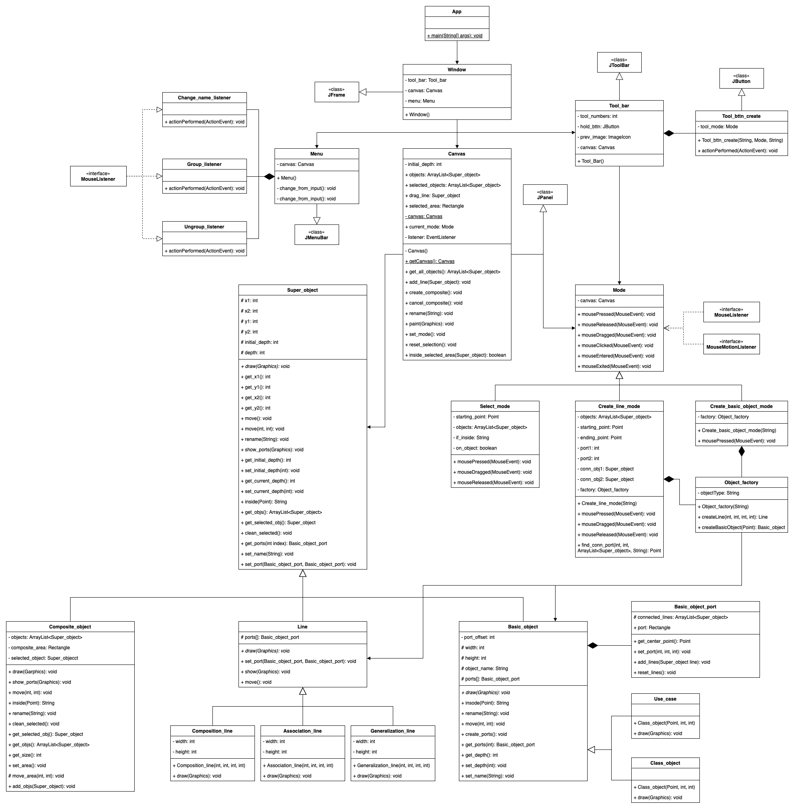

# UML Editor
## UML Diagram of This Project

## Features
- Create classes
- Create use cases
- Draw association line
- Draw composition line
- Draw generalization line
- Rename classes or use cases
- group components
- ungroup componets

## How to run
to run this project, just download it and run App.java

## Problems
- It's not OK to use factory here(factory should be used in multi source, here we just have 2 sources)
- in Canvas.java, there's no need to use dynamic casting(casting down) since listener had implemented "MouseListener" and "MouseMotionListener"